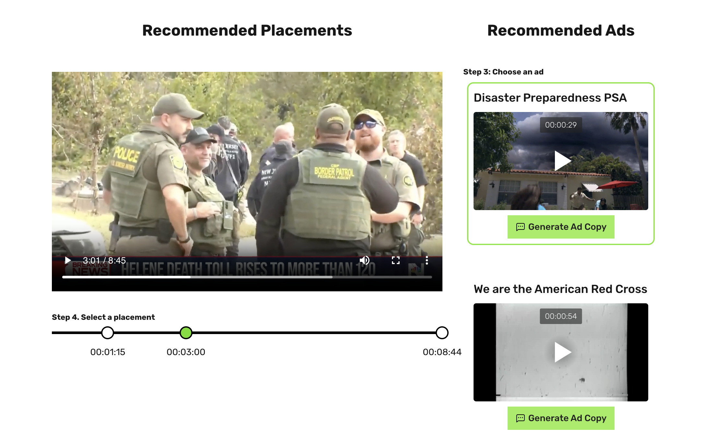
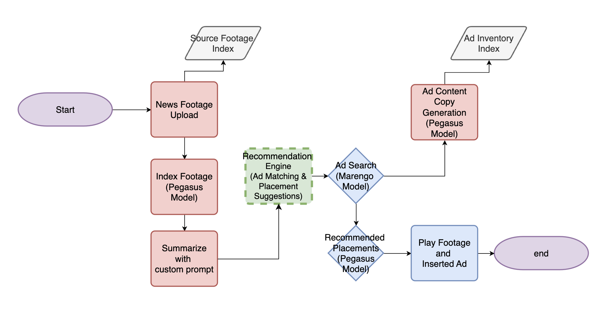
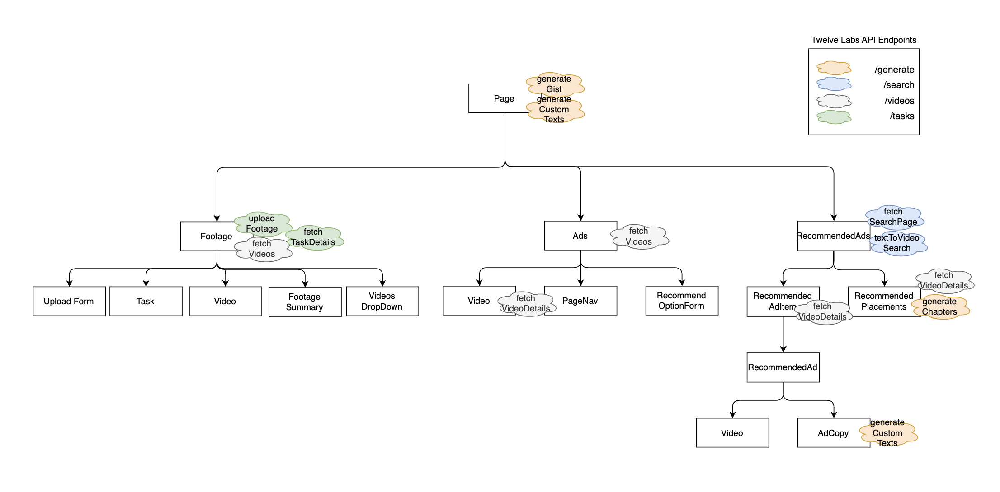

This is a [Next.js](https://nextjs.org) project bootstrapped with [`create-next-app`](https://nextjs.org/docs/app/api-reference/cli/create-next-app).

## 👋 Introduction

Contextual Ad is a tool that allows you to analyze your source footage, generate a summary, and receive ad recommendations based on the content and emotional tone of the footage. It also suggests optimal ad placements, enabling you to preview how the footage and ads work together. Additionally, you can generate ad copies, headlines, and hashtags for each ad!

<div align="center">
    
  </a>
</div>

## 📍 Process Map

<div align="center">
    
  </a>
</div>

By starting the app, the first step is to upload new source footage that you'd like to analyze and receive ad recommendations for.

If you choose not to upload new footage, the app will automatically display the latest footage from the footage index.

The next step is to analyze the footage. The analysis will provide a summary that includes the main emotions, relevant hashtags, and a brief overview of the content.

Following the analysis, you can receive ad recommendations that are best suited for the footage. You have several options for recommendations: general, emotional, visual, conversational, or you can customize your own by providing a keyword to include in the ad recommendations.

Additionally, you can generate ad copies, headlines, and hashtags for each recommended ad.

The subsequent step is to select an ad from the recommendations list and choose a placement from the recommended placement list. The placement list will show a preview of the ad and the footage together.

## 🛠️ Built With

- Next.js
- React
- TypeScript
- React Player
- Tailwind CSS
- Tanstack Query

## 🧱 Components

<div align="center">
    
  </a>
</div>

## 🚀 Prerequisites

### 1. Twelve Labs API Key

If you don't have one, visit [Twelve Labs Playground](https://playground.twelvelabs.io/) to generate your API Key.

### 2.Index Ids for source footage and ads

Make sure you have two indexes for source footage and ads. If not,

- Check [here](https://docs.twelvelabs.io/docs/create-indexes) on how to create an index and get the index id
- When creating an index, check “Logo” and “Text in Video” under “More options”
  

## 🔑 Getting Started

### 1. Clone the current repo

```sh
git clone git@github.com:mrnkim/contextual-ad.git
```

### 2. Create `.env` file in the root directory and provide the values for each key

```
TWELVELABS_API_BASE_URL=https://api.twelvelabs.io/v1.2
TWELVELABS_API_KEY=<YOUR API KEY>
NEXT_PUBLIC_FOOTAGE_INDEX_ID=<YOUR FOOTAGE INDEX ID>
NEXT_PUBLIC_ADS_INDEX_ID=<YOUR ADS INDEX ID>
```

### 3. Run the development server

```bash
npm install
npm run dev
```

### 4. Open [http://localhost:3000](http://localhost:3000) with your browser
