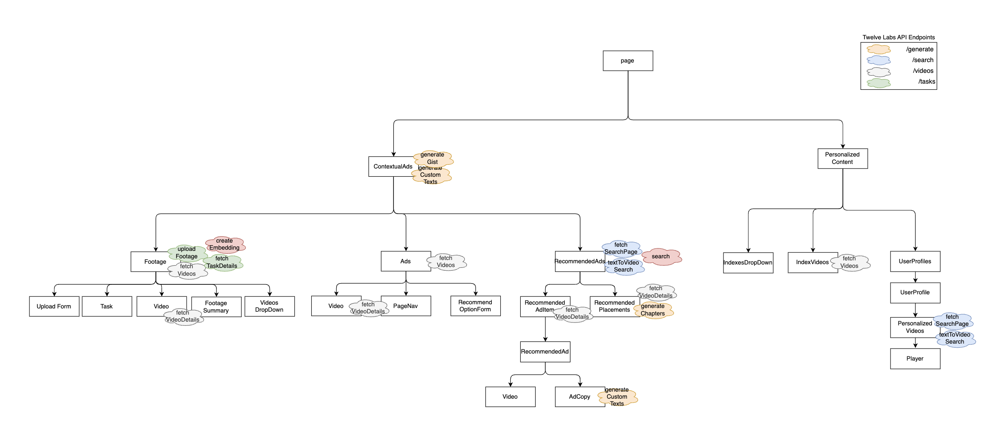

## 👋 Introduction

**Contextual Ad** is a tool that allows you to analyze your source footage, generate a summary, and receive ad recommendations based on the content and emotional tone of the footage. It also suggests optimal ad placements, enabling you to preview how the footage and ads work together. Additionally, you can generate ad copies, headlines, and hashtags for each ad!

**Personalized Content** is an app that delivers tailored, relevant video recommendations by leveraging detailed user profiles and preferences.


## 🧱 Components



## 🚀 Prerequisites

### 1. Twelve Labs API Key

If you don't have one, visit [Twelve Labs Playground](https://playground.twelvelabs.io/) to generate your API Key.

### 2.Index Ids for source footage and ads

Make sure you have two indexes for source footage and ads. If not,

- You can create the new indexes in [Twelve Labs Playground](https://playground.twelvelabs.io/)
- Or check [here](https://docs.twelvelabs.io/docs/create-indexes) on how to create an index and get the index id

## 🔑 Getting Started

### 1. Clone the current repo

```sh
git clone git@github.com:mrnkim/contextualAdPersonalizedContent.git
```

### 2. Create `.env` file in the root directory and provide the values for each key

```
TWELVELABS_API_BASE_URL=https://api.twelvelabs.io/v1.3
TWELVELABS_API_KEY=<YOUR API KEY>
NEXT_PUBLIC_FOOTAGE_INDEX_ID=<YOUR FOOTAGE INDEX ID>
NEXT_PUBLIC_ADS_INDEX_ID=<YOUR ADS INDEX ID>
```

### 3. Run the development server

```bash
npm install
npm run dev
```

### 4. Open [http://localhost:3000](http://localhost:3000) with your browser
